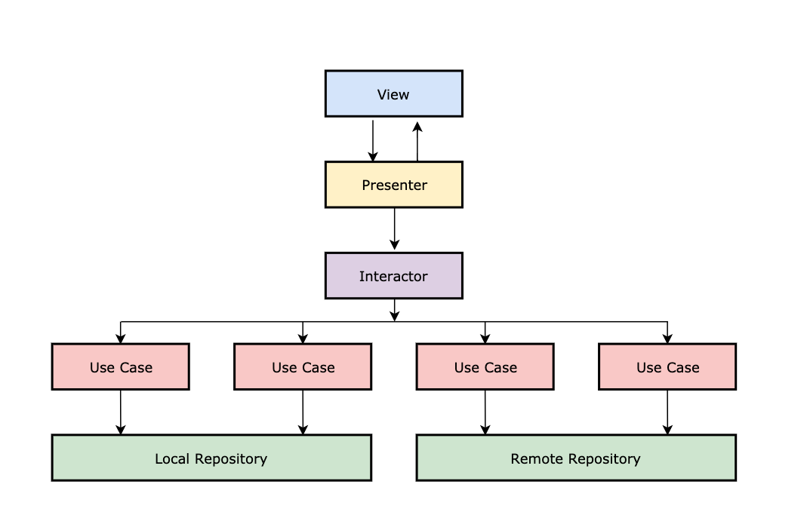

# Arquitetura
- Arquitetura é importante para nós mantermos a **nossa** qualidade, o cliente pode não ver, mas a gente vê todo dia.
- Se uma arquitetura não é bem definida ou se não existe uma, muita coisa pode ficar jogada, pode ter muita duplicação e pode acabar não sendo escalável.

---
## Hoje seguimos uma arquitetura nesse fluxo:



---
## View
- A **View** é a camada que só recebe ordens, ela não possui condições, regras de negócio ou de apresentação.
- Ela possui uma referência do *Presenter*, esse que receberá os *eventos* que a **View** disparar.
- No Android, ela normalmente é uma *Activity* ou *Fragment*.

`exemplo:`
```kotlin
private lateinit var presenter: MeuPresenter

/* declarações e construção */

private fun inicializarEventos() {
    et_usuario.doAfterTextChanged { texto -> presenter.verificaUsuario(texto.toString()) }
    et_senha.doAfterTextChanged { texto -> presenter.verificaSenha(texto.toString()) }
    bt_fazer_login.setOnClickListener { presenter.fazLogin() }
}

override fun habilitaBotao() {
    bt_fazer_login.isEnabled = true
}

override fun desabilitaBotao() {
    bt_fazer_login.isEnabled = false
}

override fun mostraLoading() {
    loading.isVisible = true
}

override fun escondeLoading() {
    loading.isVisibile = false
}

override fun mostraErro(mensagem: String) {
    /* construção de um dialog com a mensagem de erro */
}

override fun vaiParaTelaInicial() {
    startActivity(Intent(this, TelaInicialActivity::class.java))
    finish()
}
```

---
## Presenter
- O **Presenter** é a camada responsável por tratar as regras de apresentação da *View*.
- Ele possui uma referência da *View* e uma do *Interactor*.
- Ele é responsável pela manipulação de *Threads*.

`exemplo:`
```kotlin
private lateinit var view: MinhaView
private lateinit var interactor: MeuInteractor

/* declarações e construção */

private var usuario: String = ""
private var senha: String = ""

override fun verificaUsuario(usuario: String) {
    this.usuario = usuario
    verificaCredenciais()
}

override fun verificaSenha(senha: String) {
    this.senha = senha
    verificaCredenciais()
}

override fun fazLogin() {
    disposeBag.add(
        interactor.fazLogin(usuario, senha)
            .subscribeOn(Schedulers.io())
            .observeOn(AndroidSchedulers.mainThread())
            .doOnSubscribe { view.mostraLoading() }
            .doAfterTerminate { view.escondeLoading() }
            .subscribe(
                onComplete = { view.vaiParaTelaInicial() },
                onError = { erro -> view.mostraErro(interactor.pegarMensagemDoErro(erro)) }
            )
    )
}

private fun veriricaCredenciais() {
    if (usuario.isNotEmpty() && senha.isNotEmpty()) {
        view.habilitaBotao()
    } else {
        view.desabilitaBotao()
    }
}
``` 

---
## Interactor
- O **Interactor** é o agregador de regras de negócio, essas que normalmente estão dentro de *UseCases*, *Validators*, *Handlers* e afins. Ele, sozinho, nessa arquitetura, faz nada. Ou seja, ele necessita dessas regras de negócio.

`exemplo de regras de negócio:`
```kotlin
interface FazLoginUseCase {
    fun fazLogin(usuario: String, senha: String): Completable
}

class FazLoginUseCaseImpl(
    private val repositorioServidor: RepositorioServidor
): FazLoginUseCase {
    
    override fun fazLogin(usuario: String, senha: String) =
        repositorioServidor.fazLogin(usuario, senha)
}

interface TratadorDeErro {
    fun pegaMensagemDoErro(erro: Throwable): String
}

class TratadorDeErroImpl: TratadorDeErro {

    override fun pegaMensagemDoErro(erro: Throwable) = 
        when (erro) {
            is IOException -> "Você está sem internet, tente mais tarde."
            is HttpException -> "Houve um problema com o servidor."
        }
}
```

`exemplo de interactor:`
```kotlin
interface MeuInteractor: FazLoginUseCase, TratadorDeErro 

class MeuInteractorImpl(
    private val fazLoginUseCase: FazLoginUseCase,
    private val tratadorDeErro: TratadorDeErro
): MeuInteractor {

    override fun fazLogin(usuario: String, senha: String) = 
        fazLoginUseCase.fazLogin(usuario, senha)

    override fun pegaMensagemDoErro(erro: Throwable) =
        tratadorDeErro.pegaMensagemDoErro(erro)
}
```

---
## O futuro:


---
## Router
- O **Router** faria atualmente parte do papel das *Activities*, isto é, seria responsável por pela navegação entre outras *Activities* e também pela pilha de *Fragments*.
- Existiria um **Router** para cada *Activity* e ele teria uma referência desta.
- Toda construção de *Intents* também seria feita aqui.

`exemplo:`
```kotlin
interface MeuRouter {
    fun vaiParaTelaInicial()
}

class MeuRouterImpl(
    private val activity: MinhaActivity
): MeuRouter {

    override fun vaiParaTelaInicial() {
        activity.startActivity(Intent(activity, TelaInicial::class.java))
        activity.finish()
    }
}
```

---
## ViewModel
- A maior diferença do **ViewModel** para o *Presenter* seria a não existência de uma referência da *View*. A *View* teria a referência do **ViewModel** e apenas isso.
- Por esse motivo, 0 **ViewModel** é muito dependente do padrão de projeto *Observer*.

`exemplo de ViewModel:`
```kotlin
private lateinit var interactor: MeuInteractor
private lateinit var router: MeuRouter

private var usuario = ""
private var senha = ""

private val credenciaisSaoValidas = MutableLiveData<Unit>()
private val credenciaisSaoInvalidas = MutableLiveData<Unit>()
private val estaCarregando = MutableLiveData<Unit>()
private val naoEstaCarregando = MutableLiveData<Unit>()
private val houveErroNoLogin = MutableLiveData<String>()

override fun credenciaisSaoValidas(): LiveData<Unit> = crendeciaisSaoValidas

override fun credenciaisSaoInvalidas(): LiveData<Unit> = credenciaisSaoInvalidas

override fun estaCarregando(): LiveData<Unit> = estaCarregando

override fun naoEstaCarregando(): LiveData<Unit> = naoEstaCarregando

override fun houveErroNoLogin(): LiveData<Unit> = houveErroNoLogin

override fun verificaUsuario(usuario: String) {
    this.usuario = usuario
    verificaCredenciais()
}

override fun verificaSenha(senha: String) {
    this.senha = senha
    verificaCredenciais()
}

override fun fazLogin() {
    disposeBag.add(
        interactor.fazLogin(usuario, senha)
            .subscribeOn(Schedulers.io())
            .observeOn(AndroidSchedulers.mainThread())
            .doOnSubscribe { estaCarregando.postValue(Unit) }
            .doAfterTerminate { estaCarregando.postValue(Unit) }
            .subscribe(
                onComplete = { router.vaiParaTelaInicial() },
                onError = { erro -> 
                    houveErroNoLogin.postValue(
                        interactor.pegarMensagemDoErro(erro)
                    ) 
                }
            )
    )
}

private fun verificaCredenciais() {
    if (usuario.isNotEmpty() && senha.isNotEmpty()) {
        credenciaisSaoValidas.postValue(Unit)
    } else {
        credenciaisSaoInvalidas.postValue(Unit)
    }
}

```

`exemplo de como ficariam a View:`
```kotlin

private lateinit var viewModel: MeuViewModel

/* declarações e construção */

private fun inicializarEventos() {
    et_usuario.doAfterTextChanged { texto -> viewModel.verificaUsuario(texto.toString()) }
    et_senha.doAfterTextChanged { texto -> viewModel.verificaSenha(texto.toString()) }
    bt_fazer_login.setOnClickListener { viewModel.fazLogin() }

    inicializaViewModel()
}

private inicializaViewModel() {
    viewModel.credenciaisSaoValidas()
        .observe(this, Observer {
            bt_fazer_login.isEnabled = true
        })

    viewModel.credenciaisSaoInvalidas()
        .observe(this, Observer {
            bt_fazer_login.isEnabled = false
        })

    viewModel.estaCarregando()
        .observe(this, Observer {
            loading.isVisible = true
        })

    viewModel.naoEstaCarregando()
        .observe(this, Observer {
            loading.isVisible = false
        })

    viewModel.houveErroNoLogin()
        .observe(this, Observer { mesagemDeErro ->
            /* construção de um dialog com a mensagem de erro */
        })
}
```